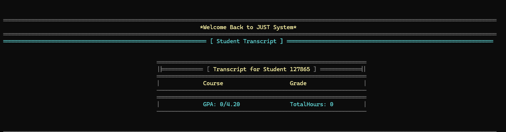

# 🎓 JUST University Management System
## 🎥 Demo Video

---
## 📄 Project Documentation

You can read the full project report on [Google Drive](https://drive.google.com/file/d/1YnTryV2wD49HmWCfngDJXf2G0OO8REt-/view?usp=sharing).
---
## 📖 Project Overview
The **JUST University Management System** is a comprehensive project developed in C++, designed to simulate a real-world university environment. This system provides advanced solutions for managing all academic and administrative operations, making it an effective tool for students, teachers, and administrators.

The project's primary goal is to deliver a centralized system that facilitates interaction among all involved parties. It covers essential aspects such as:
* **User Data Management:** Organizing and storing information for students, teachers, and administrators.
* **Academic Operations:** Streamlining course registration, withdrawal, and the viewing of academic records.
* **Grades Management:** A fully integrated system for adding and automatically updating student grades.
* **Effective Communication:** Providing a mechanism for complaints and reports to ensure continuous communication between users and the administration.

The system was built using **Object-Oriented Programming (OOP)**, applying advanced concepts like **Inheritance** and **Encapsulation**. It also utilizes **data templates** to provide greater flexibility in data management. Furthermore, it relies on **text files** for permanent data storage, ensuring that no data is lost when the program is closed.
---

## 👨‍💻 Developers

This project was developed by the *JUST Logic Team*, a group of first-year students at Jordan University of Science and Technology. Despite being in our first academic year, we aimed to demonstrate strong capabilities in:

- Object-Oriented Programming (OOP)
- Task distribution and team collaboration
- Project planning and execution

### Team Members:

- **Omar Abu Jalboush** – *Computer Science*  
- **Yanal Abed** – *Computer Science*  
- **Mohammad Hanandeh** – *Software Engineering*
### 🌐 Contact & GitHub Profiles

- **Omar Abu Jalboush**  
  - GitHub: [omarabujalbosh](https://github.com/omarabujalbosh)  
  - Email: osabujalbosh24@cit.just.edu.jo  

- **Yanal Abed**  
  - GitHub: [yanal1234](https://github.com/yanal1234)  
  - Email: mahmoodabed24@gmail.com  

- **Mohammad Hanandeh**  
  - GitHub: [mohanandeh](https://github.com/mohanandeh)  
  - Email: iljoahhanandeh06@gmail.com

---
## 🎓 Student Features

The **Student Section** of the system offers a dynamic and interactive interface that empowers students to engage with the platform efficiently. Through a set of automated tools and clearly structured options, students can:

- Monitor their academic progress in real time  
- Access personal and course-related information  
- Perform essential academic tasks with ease  

This section is designed to streamline the student experience by providing intuitive access to grades, schedules, assignments, and communication tools—all in one place.
### 🔐 Login

Students can securely log in using their unique credentials. This ensures personalized access and protects academic data.

### 🧍 View Personal Information

Displays the student’s full name, university ID, major, and academic level. Helps verify and manage profile details.

### 📚 View Registered Courses

Lists all courses the student is currently enrolled in, including:
- Course name
- Course code
- Instructor name
- Credit hours

### 📊 View Grades

Allows students to track their performance in each course:
- Midterm grade
- Final grade
- Total grade
- Grade status (e.g., Passed, Failed)

### 📤Unregister from Course

Students can withdraw from any registered course by entering the corresponding line number of the course in their list.  
This action updates the course list and reflects the withdrawal immediately within the system.

### ➕ Register for a Course

Students can register for any available course by entering the corresponding line number of the course from the offered list.  
Once selected, the course is added to the student's registered courses and reflected immediately within their academic profile.

### 📝 Submit Report or Complaint

Students can send reports or complaints directly to the administration through the system.  
This feature facilitates clear and structured communication between students and administrative staff by allowing:

- Submission of a written message describing the issue or feedback  
- Automatic identification of the sender’s role (Student or Instructor)  
- Display of the sender’s university ID alongside the message  

This ensures that administrators receive complete context when reviewing submissions, making it easier to respond appropriately and efficiently.
### 🛠️ Edit Profile

Students can update their personal information through the system.
This includes modifying details such as:

- Full name
-Password

This feature ensures that student records remain accurate and up to date, while also allowing students to maintain account security.

### 🎓 View Passed Courses & Academic Summary

Students can access a summary of all previously passed courses through this feature.  
The system displays:

- Names and codes of all successfully completed subjects  
- Final grades for each passed course  
- Total number of credit hours completed  
- Current GPA based on passed subjects

This feature helps students track their academic progress and performance over time in a clear and organized way.
---

## 👨‍🏫 Instructor Features

The **Instructor Section** of the system provides essential tools that help instructors manage their courses and communicate with administration effectively. Each feature is designed to streamline academic responsibilities and maintain accurate profile data.

### 📚 View My Courses
Displays a list of all courses currently taught by the instructor.  
Includes course names, codes, and relevant academic details.

### 👥 View Students in My Courses

Allows instructors to view the list of enrolled students for each course.  
Provides student names and university IDs for easy reference and management.

### 📝 Submit a Complaint

Instructors can send formal complaints or reports to the administration.  
The system automatically includes:
- Instructor role and university ID  
- Message content  
This ensures that the administration receives complete context for each submission.

### 🛠️ Edit My Profile

Instructors can update their personal account information, including:
- Full name  
- University ID  
- Password  
This feature helps maintain accurate records and ensures account security.
---
## 🛡️ Admin Role  

### Overview  
The **Admin** is the core and central authority of the University Management System.  
They have full access to academic and administrative operations, ensuring:  
- System integrity and security.  
- Coordination between students, instructors, and courses.  
- Monitoring complaints, reports, and statistics.  

In short, the **Admin** acts as the main control point for all academic entities.  

---

### 👨‍🎓 Student Management  

#### Overview  
This module provides the Admin with full control over student accounts and records.  
From here, the Admin can add, edit, delete, search, or display all students.  

##### [1] Add Student  
  
  
- Create a new student account.  
- Collect details (name, gender, email, phone, college, department, major, etc.).  
- Generate a unique Student ID automatically.  
- Save data into the system and update storage files.  

##### [2] Edit Student  
  
  
- Modify an existing student’s details.  
- Search by Student ID.  
- Update fields such as name, contact info, academic status, GPA, or study level.  

##### [3] Delete Student  
  
- Permanently remove a student from the system.  
- Delete personal and academic data from records.  

##### [4] Search Student  
  
  
- Find a student using their ID.  
- Display detailed personal and academic information.  

##### [5] Show All Students  
- Display all students registered in the system.  
- Includes Student ID, name, and basic academic details.  

##### [6] Back to Main Menu  
- Return to the Admin Main Menu without making changes.  

---

### 📚 Course Management  

#### Overview  
This module allows the Admin to manage all courses offered by the university (add, edit, delete, or view).  

##### [1] Add Course  
  
  
- Create a new course.  
- Enter details (course code, name, credit hours, department, instructor, schedule, location, capacity).  
- Store the course in the course list and update files.  

##### [2] Edit Course  
  
  
- Modify an existing course.  
- Search by course code.  
- Update fields such as course name, credit hours, instructor, or capacity.  

##### [3] Delete Course  
- Permanently remove a course.  
- Ensure students and instructors linked to the course are updated.  

##### [4] Show All Courses  
- Display all courses currently available in the system.  
- Includes details: course code, name, credit hours, instructor, schedule, and capacity.  

##### [5] Back to Main Menu  
- Return to the Admin Main Menu.  

---

### 📝 Registration Management  

#### Overview  
This module allows the Admin to manage course registrations.  
The Admin can register or unregister students, view student’s courses, or see students enrolled in a specific course.  

##### [1] Register Student in Course  
  
- Register a student into a specific course.  

##### [2] Unregister Student  
  
- Remove a student from a course.  

##### [3] Show Student's Courses  
  
  
- Display all courses a student is currently enrolled in.  

##### [4] Show Course's Students  
  
- Display all students registered in a given course.  

##### [5] Back to Main Menu  
- Return to the Admin Main Menu.  

---

### 🏆 Grades Management  

#### Overview  
This module allows the Admin to manage student grades.  
The Admin can add or edit grades and view student grade histories across courses.  

##### [1] Add/Edit Grade  
  
- Add or update grades for a student.  
- Supports multiple assessments: First Exam, Second Exam, Midterm, Final.  

##### [2] Show Student Grades  
  
- View grades of a specific student across all their courses.  
- Shows individual assessments and total grade.  

##### [3] Back to Main Menu  
- Return to the Admin Main Menu.  

---

### 📊 Reports Management  

#### Overview  
This module provides reports and statistics across the entire system.  
The Admin can review complaints, analyze statistics, and track skipped subjects.  

##### [1] Complaints Box  

- View all complaints submitted by students or instructors.  
- Review and resolve academic or administrative issues.  

##### [2] Complete Statistics  
- View system-wide statistics for students, instructors, and courses.  
- Includes total numbers and academic trends.  

##### [3] Skipped Subjects Marks  

- Track subjects that students skipped.  
- Review marks and performance in missed courses.  

##### [4] Back to Main Menu  
- Return to the Admin Main Menu.  

